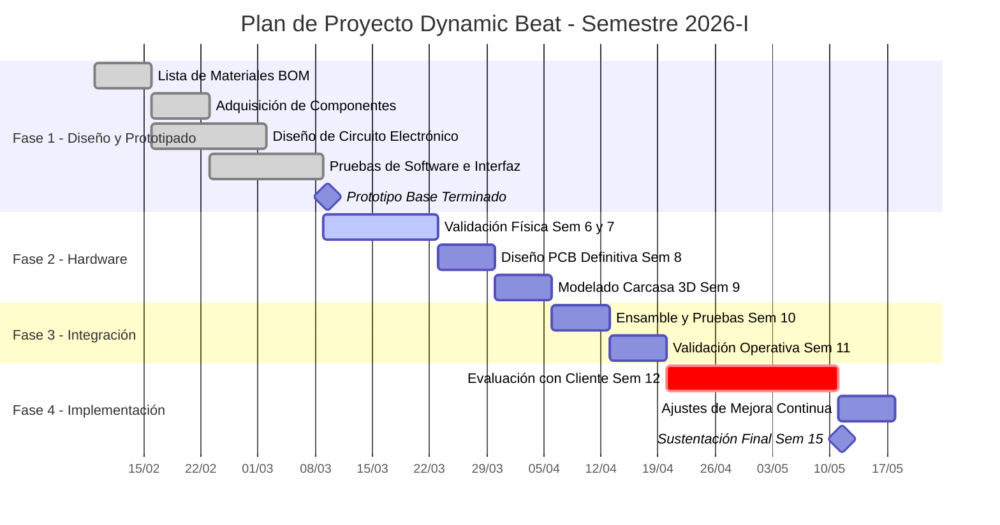

#  CDIO3_Eq4_Dynamic_Beat - Dispositivo de Fisioterapia

Este repositorio contiene el código fuente, el diseño de hardware y la documentación técnica correspondiente al desarrollo del Prototipo Mínimo Viable (PMV) de nuestro dispositivo de asistencia fisioterapéutica.

## 📑 Tabla de Contenidos
- [Tecnologías Utilizadas](#-tecnologías-utilizadas)
- [Estado del Proyecto](#-estado-del-proyecto-pmv)
- [Cronograma de Ejecución](#-cronograma-de-ejecución)

## 🛠️ Tecnologías Utilizadas
- **Microcontroladores:** Red de placas ESP32
- **Sensores:** Arreglo de sensores ultrasónicos
- **Diseño de Hardware:** Desarrollo de PCB a medida y modelado de carcasa 3D
- **Validación:** Pruebas de software e interfaz de usuario

## ⚠️ Estado del Proyecto (PMV)
Actualmente contamos con un prototipo base funcional y los siguientes entregables en curso:
- **Gestión:** Lista de materiales (BOM) consolidada y elementos adquiridos.
- **Hardware:** Diseño de circuito base completado; en fase de pruebas físicas.
- **Software:** Pruebas iniciales de software e interfaz superadas.

## 📅 Cronograma de Ejecución

A continuación, se presenta la planificación del proyecto distribuida por semanas académicas y fases de desarrollo:

